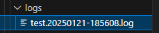
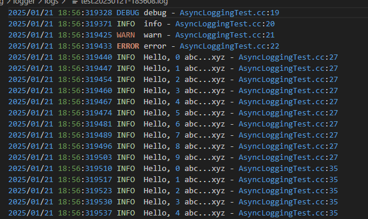

# kamaLog
> ⭐️ 本项目为[【代码随想录知识星球】](https://programmercarl.com/other/kstar.html) 教学项目

# 项目概述
本项目是一个简化版的日志系统，基于多生产者、单消费者模型，采用双缓冲机制，旨在高效地记录和管理日志信息。

## 运行环境
- Ubuntu 22.04 LTS
- C++11及以上

## 编译指令

第一步：进入到项目文件夹

```shell 
cd kamaLog 
```

第二步：生成项目可执行程序

```shell
cd logger
make
```

第三步：运行测试文件

```shell
./test
```

## 整体框架

- **Logger类**：提供日志记录的接口，支持不同级别的日志输出。
- **AsyncLogging类**：实现异步日志记录，负责将日志从前端缓冲区写入后端文件。
- **LogStream类**：用于格式化日志消息，支持多种数据类型的输出。
- **LogFile类**：管理日志文件的创建、写入和滚动。
- **FixedBuffer类**：提供固定大小的缓冲区，用于存储日志数据。
- **Timestamp类**：用于获取和格式化当前时间戳。
- **FileUtil类**：封装文件操作，负责日志真正的写入和刷新。

## 运行结果

通过运行 `./test` 可执行程序，日志文件将存放在 `logs` 目录中。每次运行程序时，都会生成新的日志文件，记录程序的运行状态和错误信息。

### 日志文件示例

- 当我们运行可执行程序会发现在logger中的logs文件中，会出现异步写入到磁盘的日志文件,如：
   


- 日志文件内容将以时间戳命名，内容包括时间、日志级别、文件名和行号等信息,如：
  


## 总结

- 本项目实现了一个高效的日志系统，采用双缓冲机制，能够在高并发环境下有效地记录日志信息。
- 通过结合FixedBuffer和Timestamp类，提供了高效的日志记录和管理功能。
- 项目的设计考虑了性能和易用性，适合在现代应用程序中使用。
- 未来将继续完善，欢迎更多开发者参与学习与贡献。
